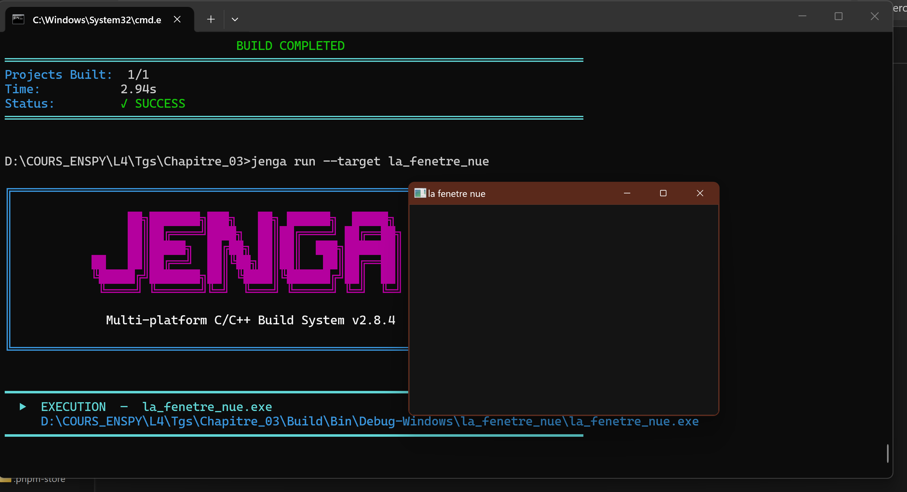

# Chapitre 3 – Exercice 1 : La fenêtre nue

> Dépôt : `ani-4087/chapitre-03/exo1-la_fenetre_nue/` · Fichier : `c4-exo1_reponse.md`

## 1. Énoncé

Nous écrivons le programme de quinze lignes de ce chapitre, nous le construisons avec Jenga et nous le lançons.

Nous rendons le fichier `.jenga` et une capture de la fenêtre. Nous indiquons combien de temps cela nous a pris, honnêtement : ce nombre nous servira de référence pour mesurer nos progrès.

## 2. Étapes de résolution

1. Créer le projet  (fichier source `main.cpp`).
2. Recopier le programme du chapitre : `NkWindowConfig` (titre, largeur, hauteur), création de `NkWindow`, test `IsValid()` avec `return 1` en cas d'échec, boucle `while (fenetre.IsOpen())` appelant `NkEvents().PollEvents()`. Compter les lignes : il doit y en avoir quinze.
3. Modifier le fichier `.jenga` du projet.
4. Construire avec Jenga : `jenga build --target la_fenetre_nue`.
5. Lancer l'exécutable et vérifier que la fenêtre s'ouvre, reste ouverte et se ferme `jenga run --target la_fentere_nue`.
6. Prendre la capture (fenêtre entière, titre visible) et la placer dans `images/`.

## 0. Environnement de mesure (à remplir une seule fois par session)

| Élément | Valeur |
|---|---|
| Date / heure |30/09/2026 , 17h55 |
| OS + version | Win11 , 22H2|
| CPU / RAM |i7 7th / 16 Go |
| Compilateur |clang-mingw |
| Version de Jenga |2.8.4 |
| Écran : résolution / mise à l'échelle (DPI %) / fréquence | 3840 x 2160 / 282 DPI / 60Hz |
| Mode d'alimentation (secteur / batterie) | secteur |
| Applications lourdes ouvertes en fond ? | non|

## 4. Méthodologie de mesure

**Ce qu'on mesure** : le temps total pour réussir l'exercice, décomposé en phases.

| Phase | Début | Fin |
|---|---|---|
| A. Écriture du code | on ouvre l'éditeur | dernière ligne saisie |
| B. Écriture du `.jenga` | fin de A | fichier enregistré |
| C. Compilation | on lance le build | build terminé |
| D. Premier lancement | on lance l'exe | fenêtre visible |

- **Chronomètre** : un seul chronomètre continu (téléphone), tours (« lap ») à chaque changement de phase. On note les valeurs brutes.
- **Le build est mesuré par la machine, pas à la main** :
  - PowerShell : `Measure-Command { jenga build --target la_fenetre_nue } | Select-Object TotalSeconds`
- **Répétition du build** : 5 builds à froid (dossier de build supprimé avant chaque essai) et 5 builds à chaud (rien n'a changé). On rapporte les deux moyennes séparément.
- **Taille de l'exécutable** (facultatif mais utile comme référence) :
  - PowerShell : `(Get-Item D:\COURS_ENSPY\L4\Tgs\Chapitre_03\Build\Bin\Debug-Windows\la_fenetre_nue\la_fenetre_nue.exe).Length` (octets)
  - Empreinte : `Get-FileHash D:\COURS_ENSPY\L4\Tgs\Chapitre_03\Build\Bin\Debug-Windows\la_fenetre_nue\la_fenetre_nue.exe -Algorithm SHA256` / `sha256sum D:\COURS_ENSPY\L4\Tgs\Chapitre_03\Build\Bin\Debug-Windows\la_fenetre_nue\la_fenetre_nue.exe`
- L'essai humain (phases A, B, D) n'est fait **qu'une fois** : c'est notre référence de départ, pas une moyenne. On le dit explicitement.

**Traitement statistique** (voir [`../../mesures/stats.py`](../../mesures/stats.py)) :
`python ../../mesures/stats.py v1 v2 v3 ...` renvoie n, moyenne, médiane, écart-type (échantillon), min, max.
On rapporte toujours **moyenne ± écart-type (n = …)** et on signale toute valeur aberrante au lieu de la supprimer en silence.

## 5. Code source

- [`main.cpp`](src/main.cpp)
- [`la_fenetre_nue.jenga`](src/la_fenetre_nue.jenga)

```cpp
int nkmain(const nkentseu::NkEntryState &state){
    nkentseu::NkWindowConfig config;
    config.title = "la fenetre nue";
    config.width = 1000;
    config.height = 720;

    nkentseu::NkWindow fenetre(config);

    if(!fenetre.IsValid()){
        return 1;
    }

    while (fenetre.IsOpen()){
        nkentseu::NkEvents().PollEvents();
    }

    return 0;
}
```

## 6. Captures


*Légende : affichage de la fenetre après compilation*

## 7. Résultats

| Phase | Durée |
|---|---|
| A. Code | 5 min 31 s 92 |
| B. `.jenga` | 30 s 23|
| C. Build  (moy ± σ, n=5) | (1.5249 ± 0.0516) s |
| D. Premier lancement |  31.34011 sec (arrêt avec le gestionnaire des tâches) |
| **Total (hors builds répétés)** | *6 min 35.015 ± 0.052 s* |

## 8. Analyse

**Attendu :** Une fenêtre vide (nue)

**Observé :** Une fenêtre vide (nue) qui ne se ferme pas sauf avec l'arrêt de l'éxécution du programme

- **Quelle phase a été la plus longue, et pourquoi ?**  
  Réponse : la rédaction du code et l'arrêt du programme
- **Qu'est-ce qui nous a bloqués ?**  
  Réponse : une erreur d'allocation de mémoire lors de l'éxécution, il a été résolu avec un build rigoureux des modules NKWindow et NKEvent , avant la construction du kit.

## 9. Limites et honnêteté des mesures

- Sources d'erreur  : chronomètre humain

