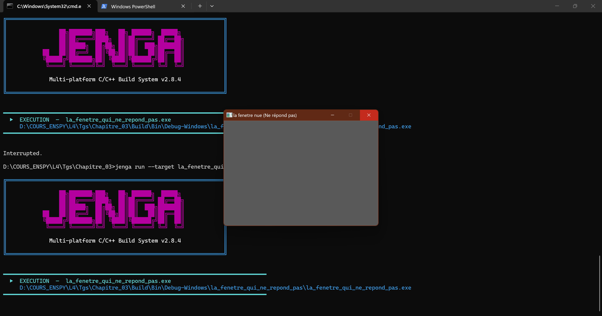

# Chapitre 3 – Exercice 2 : La fenêtre qui ne répond pas

> Dépôt : `ani-4087/chapitre-03/exo2-la_fenetre_qui_ne_repond_pas/` · Fichier : `c4-exo2_reponse.md`

## 1. Énoncé

Nous remplaçons le corps de la boucle par un commentaire, de façon à ne plus appeler `PollEvents`.

Nous lançons le programme, nous attendons, et nous rendons une capture du moment où le système déclare la fenêtre bloquée. Nous chronométrons au bout de combien de secondes cela arrive sur notre machine.

## 2. Étapes de résolution

1. Copier le projet de l'exercice 1 .
2. Dans la boucle, remplacer `NkEvents().PollEvents();` par le commentaire `// NkEvents().PollEvents();`.
3. Construire et lancer. Ne **pas** toucher à la fenêtre pendant l'attente (curseur hors de la fenêtre, aucun clic).
4. Démarrer le chronomètre au moment où la fenêtre apparaît ; l'arrêter quand le système affiche l'état « ne répond pas ».
5. Capturer l'écran à ce moment précis et placer l'image dans `images/`.
6. Répéter 10 fois (fermer le processus entre chaque essai via le gestionnaire de tâches).

## 0. Environnement de mesure (à remplir une seule fois par session)

| Élément | Valeur |
|---|---|
| Date / heure |30/09/2026 , 18h55 |
| OS + version | Win11 , 22H2|
| CPU / RAM |i7 7th / 16 Go |
| Compilateur |clang-mingw |
| Version de Jenga |2.8.4 |
| Écran : résolution / mise à l'échelle (DPI %) / fréquence | 3840 x 2160 / 282 DPI / 60Hz |
| Mode d'alimentation (secteur / batterie) | secteur |
| Applications lourdes ouvertes en fond ? | non|

## 4. Méthodologie de mesure

**Ce qu'on mesure** : délai entre l'apparition de la fenêtre et sa déclaration comme bloquée par le système.

- **Protocole fixe** : mêmes conditions à chaque essai (aucune interaction, même écran, même charge machine).
- **n = 5 essais.** On note les 5 valeurs brutes, puis moyenne, médiane, écart-type, min, max.
- **Variante à documenter à part** : un clic dans la fenêtre pendant l'attente. On ne la mélange jamais avec la série sans interaction.


**Traitement statistique** (voir [`../../mesures/stats.py`](../../mesures/stats.py)) :
`python ../../mesures/stats.py v1 v2 v3 ...` renvoie n, moyenne, médiane, écart-type (échantillon), min, max.
On rapporte toujours **moyenne ± écart-type (n = …)** et on signale toute valeur aberrante au lieu de la supprimer en silence.

## 5. Code source

- [`main.cpp`](src/main.cpp)
- [`la_fenetre_qui_ne_repond_pas.jenga`](src/la_fenetre_qui_ne_repond_pas.jenga)

```cpp
int nkmain(const nkentseu::NkEntryState &state){
    nkentseu::NkWindowConfig config;
    config.title = "la fenetre nue";
    config.width = 1000;
    config.height = 720;

    nkentseu::NkWindow fenetre(config);

    if(!fenetre.IsValid()){
        return 1;
    }

    while (fenetre.IsOpen()){
        //nkentseu::NkEvents().PollEvents();
    }

    return 0;
}
```

## 6. Captures


*Légende : affichage de la fentetre bloquée après l'éxécution du programme*


## 7. Résultats

| Essai | Délai (s) |
|---|---|
| 1 | 05.70 |
| 2 | 05.37 |
| 3 |05.24|
| 4 |06.03|
| 5 | 05.57|
| **Moyenne ± σ** | (5.5820 ±  0.3069)s|

## 8. Analyse

**Attendu :** Affichage du message  ne repond pas lors de l'éxécution 

**Observé :** Affichage du message cette fenêtre ne repond pas lors de l'éxécution, arrêt forcé de l'application nécessaire

- **Le délai est-il stable d'un essai à l'autre ? Pourquoi ?**  
  Réponse : Oui, aucun changement dans l'environnement d'éxécution
- **Que voit-on exactement quand le système déclare la fenêtre bloquée ?**  
  Réponse : affichage de la fenêtre  _Ce programme ne répond pas_


## 9. Limites et honnêteté des mesures

- Sources d'erreur : chronomètre humain


