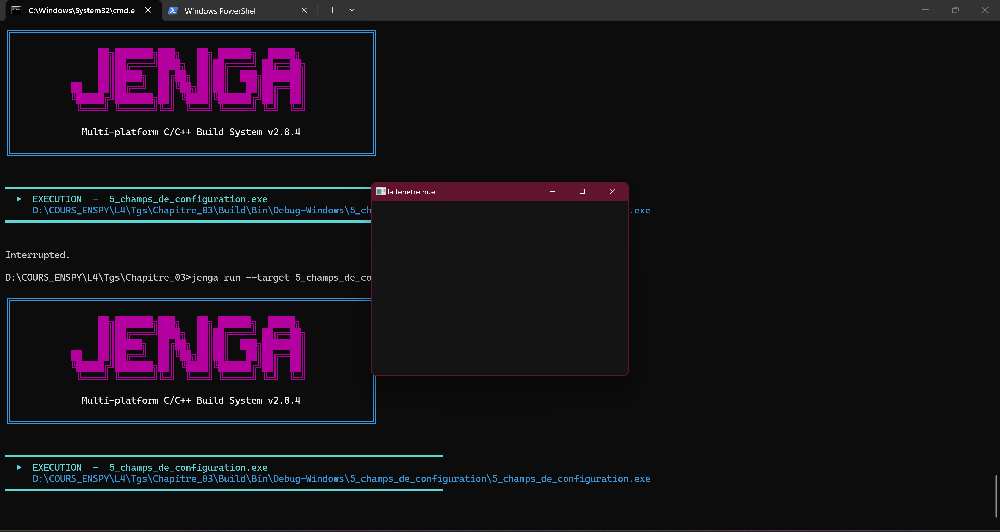
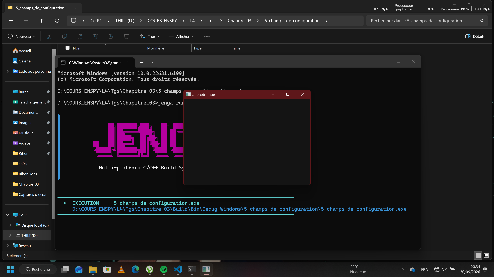
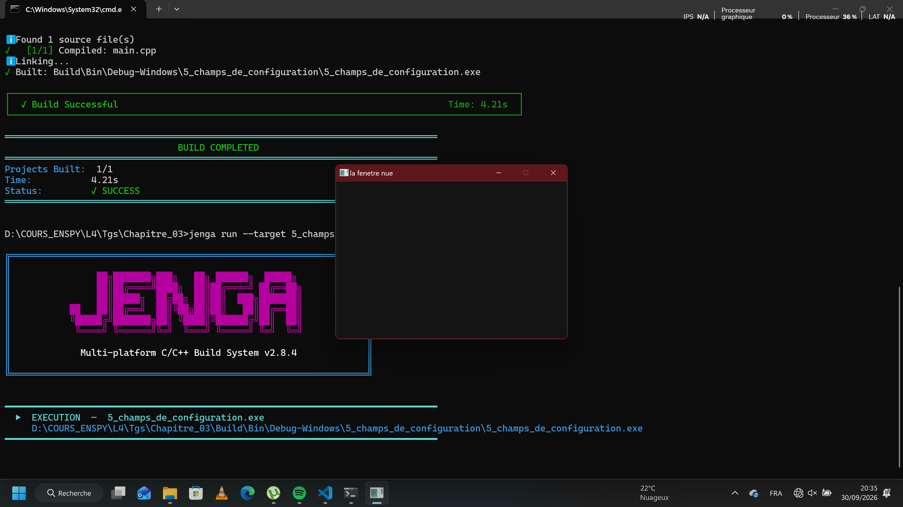
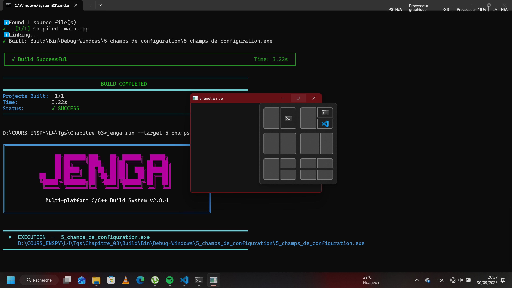
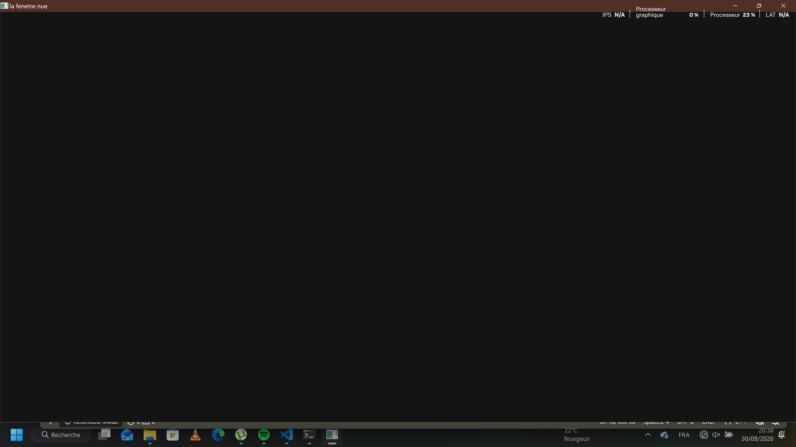
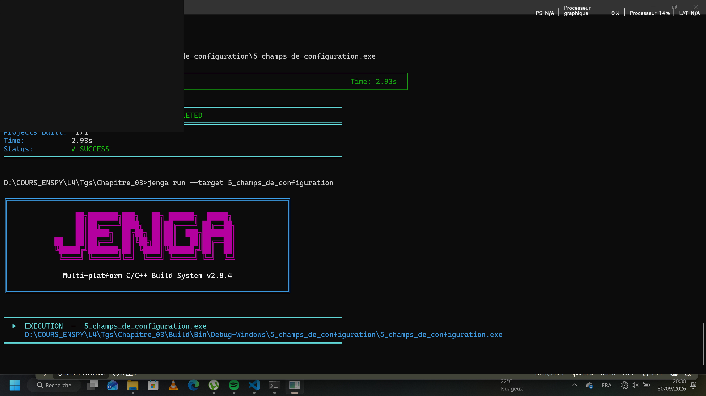

# Chapitre 3 – Exercice 3 : Cinq champs de configuration

> Dépôt : `ani-4087/chapitre-03/exo3-cinq_champs_de_configuration/` · Fichier : `c4-exo3_reponse.md`

## 1. Énoncé

Nous modifions cinq champs de `NkWindowConfig` que le chapitre n'a pas montrés, choisis dans `NkWindowConfig.h`.

Pour chacun, nous rendons la ligne, ce que nous attendions et ce que nous avons observé. Un champ qui n'a rien changé est une réponse valable, à condition de dire pourquoi nous le pensons.

## 2. Étapes de résolution

1. Ouvrir `NkWindowConfig.h` et lister **tous** les champs (nom, type, valeur par défaut).
2. Choisir cinq champs et les justifier en une phrase chacun.
3. Pour chaque champ : écrire l'**attendu** *avant* de lancer, modifier **un seul champ à la fois** (les autres restent par défaut), construire, lancer, observer, capturer.
4. Remettre la valeur par défaut avant de passer au champ suivant.
5. Si rien ne change : formuler l'explication (champ ignoré sur notre plateforme ? valeur déjà égale au défaut ? effet visible seulement dans un autre contexte ?) et la vérifier (relecture de l'implémentation ou test complémentaire).

## 0. Environnement de mesure (à remplir une seule fois par session)

| Élément | Valeur |
|---|---|
| Date / heure |30/09/2026 , 19h35 |
| OS + version | Win11 , 22H2|
| CPU / RAM |i7 7th / 16 Go |
| Compilateur |clang-mingw |
| Version de Jenga |2.8.4 |
| Écran : résolution / mise à l'échelle (DPI %) / fréquence | 3840 x 2160 / 282 DPI / 60Hz |
| Mode d'alimentation (secteur / batterie) | secteur |
| Applications lourdes ouvertes en fond ? | non|

## 4. Méthodologie de mesure

**Règle d'or : un seul paramètre varie par essai.**


## 5. Code source

- [`main.cpp`](src/main.cpp)


```cpp
    bool minimizable = false; //champ 1 , commenter et décommenter en fonction du champ à utiliser
    
    bool maximizable = false; //champ 2
    
    bool canFullscreen = false; //champ 3
    
    bool fullscreen = false; //champ 4
    
    bool frame = false; //champ 5
```

## 6. Captures


*Légende : etat initial*


*Légende : fenetre impossible à reduire*


*Légende : etat initial*


*Légende : fenetre impoossible à maximiser*


*Légende : etat initial*


*Légende : fenetre impoossible à mettre en plein ecran*


*Légende : etat initial*


*Légende : fenetre impoossible à mettre en plein ecran*


*Légende : etat initial*


*Légende : fenetre sans bord*

## 7. Résultats

| # | Champ (type, défaut, ligne du .h) | Attendu | Observation
|---|---|---|---|
| 1 | minimize|jouer sur la capacité à reduire de la fenetre |
| 2 |maximize | jouer sur la capacité à maximiser de la fenetre| 
| 3 |canFullscreen | jouer sur la capacité à etre en plein ecran de la fenetre| n'a rien changé , nous pensons ici que 'exécutable devrait s'afficher en plein écran et n'a pas pu se mettre en plein écran pour une raison inconnue|
| 4 |fullscreen |  jouer sur la capacité à etre en plein ecran de la fenetre| n'a rien changé,l'éxécutable devrait se lance directement en plain écran cela n'a pas été le cas   |
| 5 |frame | jouer sur la frame de l'ecran| 


