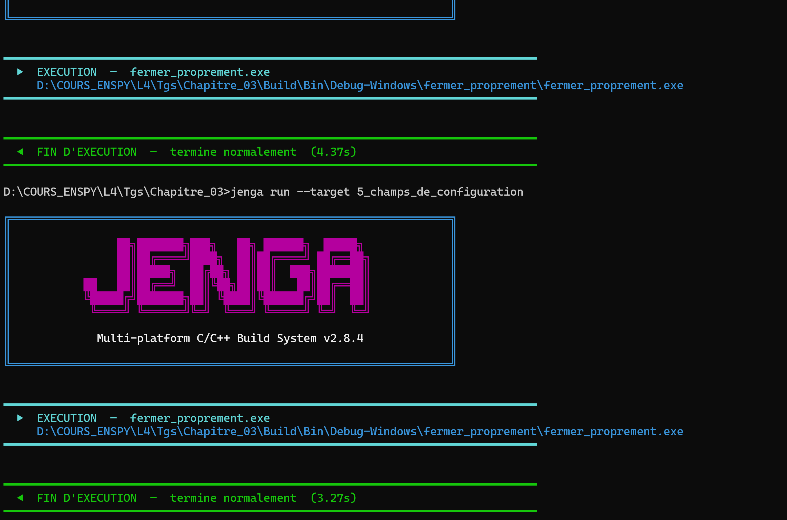

# Chapitre 3 – Exercice 4 : Fermer proprement

> Dépôt : `ani-4087/chapitre-03/exo4-fermer_proprement/` · Fichier : `c4-exo4_reponse.md`

## 1. Énoncé

Nous ajoutons un rappel sur `NkWindowCloseEvent` qui met un booléen à faux, et nous faisons porter la boucle sur ce booléen plutôt que sur `IsOpen()`.

Nous ajoutons ensuite un rappel sur `NkKeyPressEvent` qui fait la même chose sur la touche Échap.

Nous rendons le code et nous expliquons pourquoi les deux chemins de sortie doivent aboutir au même endroit.

## 2. Étapes de résolution

1. Déclarer `bool enMarche = true;` 
2. Enregistrer le rappel `NkWindowCloseEvent` → `enMarche = false`. 
3. Remplacer la condition de boucle `while (fenetre.IsOpen())` par `while (enMarche)`.
4. Enregistrer le rappel `NkKeyPressEvent` : si la touche est Échap → `enMarche = false`.
5. Placer le code de nettoyage **après** la boucle, à un seul endroit, et y afficher un message « sortie propre ».
6. Tester les deux chemins (croix, Échap) et vérifier le code de retour du processus.
7. Rédiger l'explication : un seul point de sortie = un seul endroit à maintenir, libération des ressources garantie, comportement identique quelle que soit l'origine de la demande.

## 0. Environnement de mesure (à remplir une seule fois par session)

| Élément | Valeur |
|---|---|
| Date / heure |30/09/2026 , 18h55 |
| OS + version | Win11 , 22H2|
| CPU / RAM |i7 7th / 16 Go |
| Compilateur |clang-mingw |
| Version de Jenga |2.8.4 |
| Écran : résolution / mise à l'échelle (DPI %) / fréquence | 3840 x 2160 / 282 DPI / 60Hz |
| Mode d'alimentation (secteur / batterie) | secteur |
| Applications lourdes ouvertes en fond ? | non|

## 4. Code source

- [`main.cpp`](src/main.cpp)

```cpp
if(!fenetre.IsValid()){
        return 1;
    }
    bool running= true ;
    auto& stackEvent = nkentseu::NkEvents();
    while (running){
        nkentseu::NkEvent* event;

        while((event = stackEvent.PollEvent()) != nullptr){
            if(event->Is<nkentseu::NkWindowCloseEvent>()){
                running = false;
            }
            if(event->Is<nkentseu::NkKeyPressEvent>()){
                auto* keyEvent = static_cast<nkentseu::NkKeyPressEvent*>(event);
                if (keyEvent->GetKey() == nkentseu::NkKey::NK_ESCAPE) {
                   running = false;
                }
                
        }
        
    }
```

## 5. Captures


*Légende :image de sortie*


## 6. Analyse


Les deux chemin de sortie doivent tous deux aboutir à `running=false` car ces deux chemins sont déclenché par des actions utilisatuers, précisement ici le clic sur la croix de fermeture et l'appuie du bouton echap. Certes ces touches donnent l'impression de fermer l'application mais en realité elle sont de simple touche devant conduire à un évènement et l'évènement ici est mettre le booléen running à faux, qui est celui qui determine si l'application tourne ou pas.


